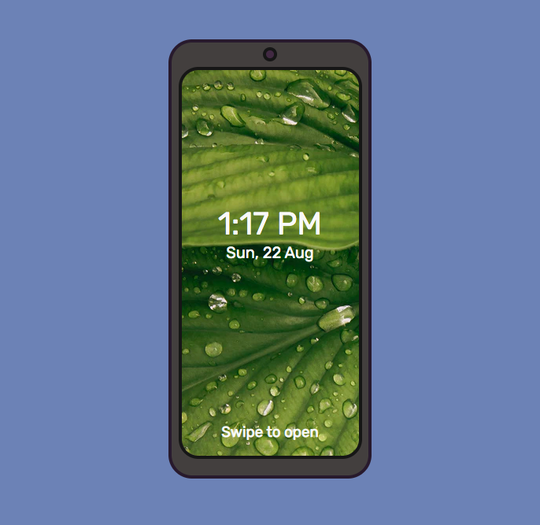
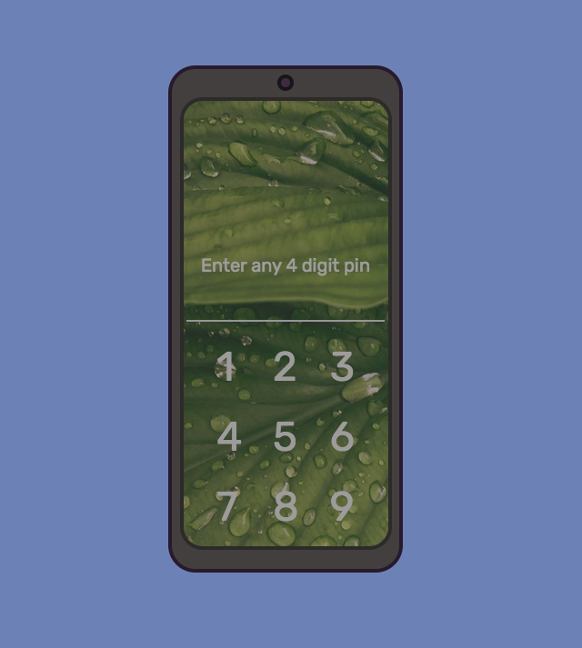
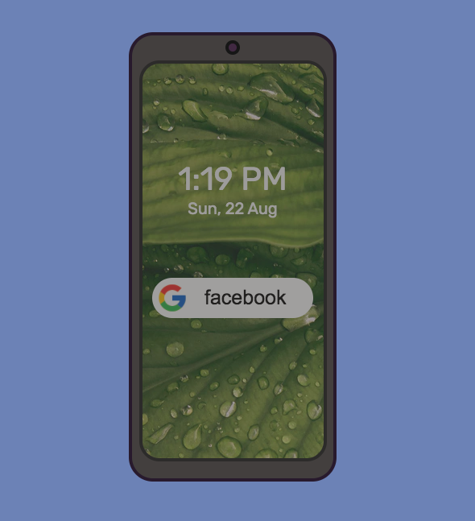

# Smartphone UI Flow

This art work showcases how a Smartphone User interface flow works. The flow begins with a lock screen where the user has to swipe the screen, after swiping the screen the user is taken to enter a 4 digit pin. Enter any 4 digit pin and user is taken to the home screen where current date and time will be displayed. There will be google search bar where in the user can input any text to search for and on pressing Enter the user get's redirected to google search engine based on the keywork given in input field.

***Note***: keypad for pin generation is controlled using click events. Does'nt support keyboard events.

## Snapshots

## Technologies Used
- HTML
- CSS
- Javascript

Refer this codepen link [Smartphone UI Flow](https://codepen.io/vaishak10/pen/JjNVymL?editors=0110) to get a clear view of this artwork along with code.

